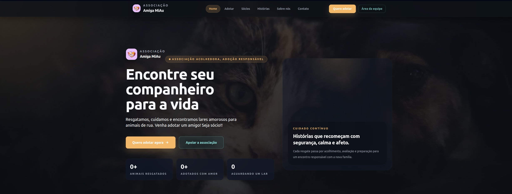

# 🐾 Amiga MiAu — Animal Protection Platform

Fullstack platform for animal adoption, NGO management and communication system.

🌐 Live Demo: https://protecao-animal.vercel.app

A fullstack web platform designed for animal protection organizations to manage adoptions, memberships, and communication with the public.

> Version: **v0.9 (Release Candidate)**

---

## ✨ Overview

This project is a complete digital solution that enables:

- Public animal adoption catalog  
- Adoption interest submission  
- Membership management  
- Payment tracking  
- Contact and communication system  
- Full administrative dashboard  

---

## 🧱 Tech Stack

- **Next.js 14 (App Router)**
- **React 18**
- **Tailwind CSS**
- **Supabase** (PostgreSQL, Auth, Storage)
- **Resend** (email delivery)
- **Playwright** (E2E testing)
- **Vercel** (deployment)

---

## 🏗️ Architecture

- Fullstack architecture using **Server Actions (Next.js)**
- Supabase as the primary backend (database, authentication, storage)
- Decoupled communication layer (`lib/email.ts`)
- Modular structure:
  - `app/` → routes and pages  
  - `components/` → UI components  
  - `lib/` → integrations and core logic  

---

## 🔐 Security

- Environment variables fully isolated (`.env` not committed)
- Proper use of `NEXT_PUBLIC_*` only for public data
- Admin keys restricted to server-side execution
- Row Level Security (RLS) enabled in database
- Sanitized logs (no sensitive data exposure)
- No hardcoded secrets in the codebase

---

## 🗄️ Data Model

Core entities:

- `animals`
- `adoption_interests`
- `contact_messages`
- `membership_interests`
- `members`
- `member_payments`
- `member_contact_history`

---

## 🎨 Design

- Dark premium UI  
- Strong focus on readability and hierarchy  
- Emotion-driven visual approach  
- Fully responsive (mobile-first)  

---

## 📌 Status

Production-ready for controlled environments.  
Solid foundation for scaling and future enhancements.

---

## 👨‍💻 Author

Developed by **Alexandre Denicol**

---

## 📄 License

This project was developed for a non-profit organization.  
For portfolio and demonstration purposes.
